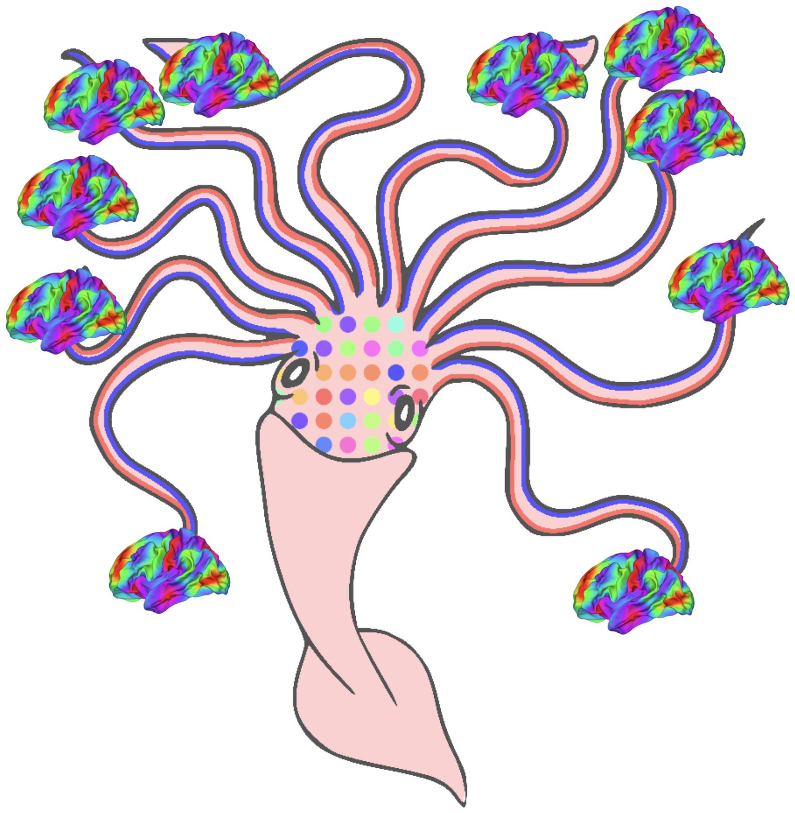
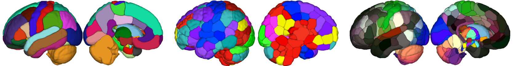

# krakencoder
[](https://zenodo.org/doi/10.5281/zenodo.11106894)



The Krakencoder is a joint connectome mapping tool that simultaneously, bidirectionally translates between structural and functional connectivity, and across different atlases and processing choices via a common latent representation.

### Citation
Keith W. Jamison, Zijin Gu, Qinxin Wang, Ceren Tozlu, Mert R. Sabuncu, Amy Kuceyeski, "Krakencoder: A unified brain connectome translation and fusion tool". _Nature Methods_ (2025) [doi:10.1038/s41592-025-02706-2](https://doi.org/10.1038/s41592-025-02706-2) 

(bioRxiv link: [doi:10.1101/2024.04.12.589274](https://www.biorxiv.org/content/10.1101/2024.04.12.589274))


The model presented in the manuscript uses a pre-computed 256-dimensional PCA to transform inputs to a common dimension, trains a 256x128 linear layer for each encoder, and a 128x256 linear layer for each decoder. The package presented here can be used to explore more complex architectures, including deeper, nonlinear encoders and decoders, alternative input/output transformations, separate latent spaces for SC or FC (bridged by an additional group-wise intergroup transformation), among many other possibilities. For our application, we found the simpler linear network to be the most robust and generalizable. See [`run_training.py`](run_training.py) for options.


# Contents
1. [Installation](#Installation)
2. [Code organization](#Code-organization)
3. [Examples](#examples)
    * [Jupyter example using pre-trained model on new data](#jupyter-example-using-pre-trained-model-on-new-data)
    * [Generating predicted connectomes from new data](#generating-predicted-connectomes-from-new-data)
    * [Generating latent space representations from new data](#generating-latent-space-representations-from-new-data)
    * [Training a model from scratch](#training-a-model-from-scratch)
    * [Adding a new flavor to an existing model](#adding-a-new-flavor-to-an-existing-model)
    * [Reading output files](#reading-output-files)
4. [Pretrained connectivity types](#pretrained-connectivity-types)
5. [Requirements](#requirements)
6. [Downloads](#downloads)

# Installation
Installing dependencies and Krakencoder package should take < 5 minutes (depending on download speeds)
```bash
#recommended: create a fresh environment using anaconda (See https://docs.anaconda.com/)
#conda create -n kraken python=3.8 -y && conda activate kraken

git clone https://github.com/kjamison/krakencoder.git
cd krakencoder
pip install -r requirements_exact.txt
pip install .

#test your environment using a pre-baked model with dummy inputs and outputs
python -m unittest

#download pretrained model and transformations to cache folder (~1.3GB)
python krakencoder/fetch.py --fetch
```

# Code organization
### Command-line scripts:
* [`run_training.py`](run_training.py): Train a new model
* [`run_model.py`](run_model.py): Run a saved checkpoint on new data
* [`merge_checkpoints.py`](merge_checkpoints.py): Merge encoders+decoders from multiple checkpoints into a single model
* [`describe_checkpoint.py`](describe_checkpoint.py): Print information about a saved checkpoint

### Internal scripts:
* [`model.py`](krakencoder/model.py): Krakencoder model class definition
* [`train.py`](krakencoder/train.py): Training-related functions
* [`loss.py`](krakencoder/loss.py): Specifies different loss functions to be used during training and evaluation
* [`data.py`](krakencoder/data.py): Functions for loading and transforming input data
* [`adaptermodel.py`](krakencoder/adaptermodel.py): KrakenAdapter model class definition, helps wrap I/O transformations
* [`plotfigures.py`](krakencoder/plotfigures.py): Functions for plotting loss curves and performance heatmaps
* [`utils.py`](krakencoder/utils.py): Miscellaneous utility functions
* [`fetch.py`](krakencoder/fetch.py): Download pretrained models and transformations
* [`merge.py`](krakencoder/merge.py): Functions for merging multiple models

# Examples

## Jupyter example using pre-trained model on new data
See [`krakencoder_example.ipynb`](krakencoder_example.ipynb) [](https://colab.research.google.com/github/kjamison/krakencoder/blob/main/krakencoder_example.ipynb) 

## Generating predicted connectomes from new data
This example evaluates a pre-trained model on new data to predict all 15 output connectome types for each subject.
```bash
python run_model.py --inputdata '[FCcorr_fs86_hpf]=mydata_fs86_FCcorr_hpf.mat' \
        '[FCcorr_fs86_hpfgsr]=mydata_fs86_FCcorr_hpf_gsr.mat' \
        '[FCpcorr_fs86_hpf]=mydata_fs86_FCpcorr_hpf.mat' \
        '[FCcorr_shen268_hpf]=mydata_shen268_FCcorr_hpf.mat' \
        '[FCcorr_shen268_hpfgsr]=mydata_shen268_FCcorr_hpf_gsr.mat' \
        '[FCpcorr_shen268_hpf]=mydata_shen268_FCpcorr_hpf.mat' \
        '[FCcorr_coco439_hpf]=mydata_coco439_FCcorr_hpf.mat' \
        '[FCcorr_coco439_hpfgsr]=mydata_coco439_FCcorr_hpf_gsr.mat' \
        '[FCpcorr_coco439_hpf]=mydata_coco439_FCpcorr_hpf.mat' \
        '[SCsdstream_fs86_volnorm]=mydata_fs86_sdstream_volnorm.mat' \
        '[SCifod2act_fs86_volnorm]=mydata_fs86_ifod2act_volnorm.mat' \
        '[SCsdstream_shen268_volnorm]=mydata_shen268_sdstream_volnorm.mat' \
        '[SCifod2act_shen268_volnorm]=mydata_shen268_ifod2act_volnorm.mat' \
        '[SCsdstream_coco439_volnorm]=mydata_coco439_sdstream_volnorm.mat' \
        '[SCifod2act_coco439_volnorm]=mydata_coco439_ifod2act_volnorm.mat' \
    --adaptmode meanfit+meanshift \
    --checkpoint kraken_chkpt_SCFC_fs86+shen268+coco439_pc256_225paths_latent128_20240413_ep002000.pt \
    --inputxform kraken_ioxfm_SCFC_fs86_pc256_710train.npy \
        kraken_ioxfm_SCFC_shen268_pc256_710train.npy \
        kraken_ioxfm_SCFC_coco439_pc256_710train.npy \
    --outputname all --output 'mydata_20240413_ep002000_in.{input}.mat' \
    --fusion --fusioninclude fusion=all fusionSC=SC fusionFC=FC --onlyfusioninputs
```
* Each input file should have a 'data' field containing the [subjects x region x region] connectivity data for that input flavor.
* This will predict all 15 connectome flavors as outputs, based on whatever inputs are provided. Not all input flavors are required, but the more input flavors you can provide, the better the predictions are.
* `--adaptmode meanfit+meanshift` uses a minimal approach for domain shift by linearly mapping the population mean of your input data to the population mean of the training data
* `--fusion` includes "fusion" predictions incorporating all inputs (or subsets, as below) into each predicted output.
* `--onlyfusioninputs` means the script will NOT output predictions for each individual input type, but only for fusion types
* `--fusioninclude fusion=all fusionSC=SC fusionFC=FC` produces "fusion", based on all inputs, and "fusion(SC|FC)" based on only SC or FC inputs
    * **fusionFC** requires that some FC flavors are provided as inputs
* Predicted outputs will be one file per input type flavor, for instance: `mydata_20240413_ep002000_in.fusionSC.mat`

## Generating latent space representations from new data
This example computes the latent space representations from new data using a pre-trained model.
```bash
python run_model.py --inputdata '[FCcorr_fs86_hpf]=mydata_fs86_FCcorr_hpf.mat' \
        '[FCcorr_fs86_hpfgsr]=mydata_fs86_FCcorr_hpf_gsr.mat' \
        '[FCpcorr_fs86_hpf]=mydata_fs86_FCpcorr_hpf.mat' \
        '[FCcorr_shen268_hpf]=mydata_shen268_FCcorr_hpf.mat' \
        '[FCcorr_shen268_hpfgsr]=mydata_shen268_FCcorr_hpf_gsr.mat' \
        '[FCpcorr_shen268_hpf]=mydata_shen268_FCpcorr_hpf.mat' \
        '[FCcorr_coco439_hpf]=mydata_coco439_FCcorr_hpf.mat' \
        '[FCcorr_coco439_hpfgsr]=mydata_coco439_FCcorr_hpf_gsr.mat' \
        '[FCpcorr_coco439_hpf]=mydata_coco439_FCpcorr_hpf.mat' \
        '[SCsdstream_fs86_volnorm]=mydata_fs86_sdstream_volnorm.mat' \
        '[SCifod2act_fs86_volnorm]=mydata_fs86_ifod2act_volnorm.mat' \
        '[SCsdstream_shen268_volnorm]=mydata_shen268_sdstream_volnorm.mat' \
        '[SCifod2act_shen268_volnorm]=mydata_shen268_ifod2act_volnorm.mat' \
        '[SCsdstream_coco439_volnorm]=mydata_coco439_sdstream_volnorm.mat' \
        '[SCifod2act_coco439_volnorm]=mydata_coco439_ifod2act_volnorm.mat' \
    --adaptmode meanfit+meanshift \
    --checkpoint kraken_chkpt_SCFC_fs86+shen268+coco439_pc256_225paths_latent128_20240413_ep002000.pt \
    --inputxform kraken_ioxfm_SCFC_fs86_pc256_710train.npy \
        kraken_ioxfm_SCFC_shen268_pc256_710train.npy \
        kraken_ioxfm_SCFC_coco439_pc256_710train.npy \
    --fusion --outputname encoded --output mydata_20240413_ep002000_out.{output}.mat
```
* All 15 input flavors are not required, but more is better.
* Latent outputs will be in the file `mydata_20240413_ep002000_out.encoded.mat`

## Training a model from scratch
This example trains a new Krakencoder model on 5 flavors of FS86 data (3 FC, 2 SC).
```bash
python run_training.py \
    --inputdata '[FCcorr_fs86_hpf]@FC=mydata_fs86_FC_hpf.mat' \
        '[FCcorr_fs86_hpfgsr]@FC=mydata_fs86_FC_hpf_gsr.mat' \
        '[FCpcorr_fs86_hpf]@FC=mydata_fs86_FCpcorr_hpf.mat' \
        '[SCsdstream_fs86_volnorm]@SC=mydata_fs86_sdstream_volnorm.mat' \
        '[SCifod2act_fs86_volnorm]@SC=mydata_fs86_ifod2act_volnorm.mat' \
    --datagroups SCFC \
    --latentsize 128 --latentunit --transformation pca256 \
    --dropout .5 --losstype correye+enceye.w10+neidist+encdist.w10+mse.w1000+latentsimloss.w10000 \
    --trainvalsplitfrac .8 --valsplitfrac .1 \
    --outputprefix mykraken --epochs 2000 --checkpointepochsevery 500 --displayepochs 25
```
* input data is specified as `'[flavor]@group=datafile.mat'`
    * `[flavor]` will be auto-corrected to canonical data flavors. To skip auto-correction, use `flavor@group=...`
    * `group` is optional, but will be automatically guessed based on `flavor` if not specified. `group` might be SC or FC
* `--datagroups SCFC` in means all groups should be included in model
* `--latentsize 128 --latentunit` means latent dimension is 128, and will be explicitly L2-normalized during training
* `--transformation pca256` will compute a new 256-dimensional PCA reduction for each input, and save it to a file `mykraken_ioxfm_....npy`
    * To use an existing PCA transform, add `--inputxform mykraken_ioxfm_...` with the given file(s).
* `--dropout .5` uses 50% dropout regularization during training
* `--losstype ...` specifies the loss functions and associated weights. See manuscript for details
* `--trainvalsplitfrac .8 --valsplitfrac .1` Use 80% of input subjects for training+validation, and 10% **of those** for validation
    * Final split will be 72% training, 8% validation, and 20% testing (completely left out)
* `--epochs 2000 --checkpointepochsevery 500` train for a total of 2000 epochs, with checkpoints every 500
* `--outputprefix mykraken` outputs will be `mykraken_*`
    * `mykraken_chkpt_*_ep######.pt` saved model checkpoints
    * `mykraken_ioxfm_*.npy` for saved input transforms (unless `--inputxform` argument was provided)
    * `mykraken_trainrecord_*.mat` training record file with training details, loss functions, etc...
    * `mykraken_log_*.txt` log outputs with training progress
    * `mykraken_loss_*.png` figure showing loss curves
    * `mykraken_heatmap_*.png` heatmap figure showing pathwise prediction performance on validation data at current training epoch
* See [run_training.py](run_training.py) or `python run_training.py --help` for more arguments, specifying deep network architectures, etc.

* A note on training times: The full 15 flavor model (225 paths) took 12 hours for 2000 epochs (23 sec/epoch) on an Nvidia A100 GPU. The training generally scales with the number of paths. A model with 5 inputs (25 paths) takes about 1 hour for 2000 epochs (1.8 sec/epoch).

## Adding a new flavor to an existing model
This example shows how to take a new connectome flavor, and a pre-computed fusion latent representation for those subjects, and train a new encoder/decode to map that new flavor to the existing latent vectors.
Ideally, these would be training subjects. After training, we run [merge_checkpoints.py](merge_checkpoints.py) to combine this new autoencoder with an existing model.

In this example, we are adding a new atlas (`cc200`), and SC estimated as raw, non-normalized streamline counts (`_count`, rather than `_volnorm`), and training it to the `fusion` representation averaged from all 15 original data flavors for the same training subjects as the original model. We then merge that autoencoder with the original 15-flavor model to create a new 16-flavor model `kraken_chkpt_20240413_ep002000_cc200count.fus_ep000500.pt`

```bash
#Step 1. Train autoencoder
python run_training.py \
    --inputdata 'SCifod2act_cc200_count=mydata_cc200_ifod2act_count.mat' \
    --encodedinputfile 'mydata_20240413_ep002000_out.encoded.mat' \
    --targetencoding --targetencodingname fusion --onlyselfpathtargetencoding \
    --subjectfile 'subject_splits_20240413.mat' \
    --latentsize 128 --latentunit --transformation pca256 \
    --dropout .5 --losstype correye+enceye.w10+neidist+encdist.w10+mse.w1000+latentsimloss.w10000 \
    --outputprefix kraken_cc200count.fus \
    --epochs 500 --checkpointepochsevery 500 --displayepochs 100

#Step 2. merge autoencoder with 15-flavor model
python merge_checkpoints.py \
    --checkpointlist 'kraken_chkpt_SCFC_fs86+shen268+coco439_pc256_225paths_latent128_20240413_ep002000.pt' \
                     'kraken_cc200count.fus_chkpt_pc256_ep000500.pt' \
    --output 'kraken_chkpt_20240413_ep002000_cc200count.fus_ep000500.pt'
    
```
For Step 1, the input arguments to [run_training.py](run_training.py) are:
* input data is specified as `'newflavor=datafile.mat'`
* `--encodedinputfile mydata_20240413_ep002000_out.encoded.mat` uses pre-computed latent vectors in this file as the target
* `--targetencoding --targetencodingname fusion --onlyselfpathtargetencoding` only train autoencoder for each input flavor, which maps input data to the pre-computed `fusion` representation contained in `--encodedinputfile`
* `--subjectfile subject_splits_20240413.mat` use the train/test/val split generated in previous training run, so the same splits can be used for testing the combined model
    * File should contain a field `subjects` with one subject ID per subject in the input data, `subjidx_train`, `subjidx_val`, and `subjidx_test` lists of indices in the range `0 - Nsubj-1`.
* `--epochs 500` only 500 epochs are needed for single-path training to pre-computed latent
* `--outputprefix kraken_cc200count.fus` outputs will be `kraken_cc200count.fus_*`
    * `kraken_cc200count.fus_chkpt_*_ep000500.pt` is the final model checkpoint
    * `kraken_cc200count.fus_*.npy` is the new 256-dimensional PCA transform computed for this flavor
    
## Reading output files
```python
import numpy as np
from scipy.io import loadmat
from krakencoder.utils import tri2square

Mpred=loadmat('mydata_20240413_ep002000_in.fusionSC.mat',simplify_cells=True)
#predicted outputs are stored in Mpred['predicted_alltypes'][inputtype][outputtype]
fusionSC_to_FCshen_triu=Mpred['predicted_alltypes']['fusionSC']['FCcorr_shen268_hpf'] 
#fusionSC_to_FCshen_triu is [Nsubj x 35778], where each row is a 1x(upper triangular) for a 268x268 matrix

#Now convert the [Nsubj x 35778] stacked upper triangular vectors to a list of [268x268] square matrices for each subject
#by default, the diagonal is filled with zeros. For FC, we might want to set those to 1 with tri2square(..., diagval=1)
nsubj=fusionSC_to_FCshen_triu.shape[0]
n=268
triu=np.triu_indices(n,k=1)
fusionSC_to_FCshen_list=[tri2square(fusionSC_to_FCshen_triu[i,:],tri_indices=triu, diagval=1) for i in range(nsubj)]

#or convert to an [Nsubj x region x region] 3D matrix:
fusionSC_to_FCshen_3D=np.stack(fusionSC_to_FCshen_list)

#or compute a single [region x region] mean across subjects:
fusionSC_to_FCshen_mean=np.mean(np.stack([tri2square(fusionSC_to_FCshen_triu[i,:],tri_indices=triu, diagval=1) for i in range(nsubj)]), axis=0)
```

# Pretrained connectivity types
The current pre-trained model has been trained on the following 15 connectivity flavors, including 3 FC and 2 SC estimates from each of 3 atlases:
* `FCcorr_fs86_hpf` `FCcorr_fs86_hpfgsr` `FCpcorr_fs86_hpf` `SCifod2act_fs86_volnorm` `SCsdstream_fs86_volnorm` 
* `FCcorr_shen268_hpf` `FCcorr_shen268_hpfgsr` `FCpcorr_shen268_hpf` `SCifod2act_shen268_volnorm` `SCsdstream_shen268_volnorm`
* `FCcorr_coco439_hpf` `FCcorr_coco439_hpfgsr` `FCpcorr_coco439_hpf` `SCifod2act_coco439_volnorm` `SCsdstream_coco439_volnorm`

### Functional Connectivity (FC) types
* `FCcorr_<parc>_hpf` Pearson correlation FC
* `FCcorr_<parc>_hpfgsr` Pearson correlation FC after global signal regression
* `FCpcorr_<parc>_hpf` Regularized partial correlation FC
* Time series have been denoised using ICA+FIX, high-pass filter > 0.01 Hz, with nuisance regression using WM+CSF aCompCor and 24 motion parameters.
* Data were preprocessed using the HCP minimal prepocessing pipeline ([Glasser 2013](https://pubmed.ncbi.nlm.nih.gov/23668970/)). Post-processing was performed using scripts found here: [github.com/kjamison/fmriclean](https://github.com/kjamison/fmriclean)

### Structural Connectivity (SC) types
* `SCifod2act_<parc>_volnorm` Streamline counts from iFOD2+ACT (Probabilistic whole-brain tractography with anatomical constraint), with pairwise streamline counts normalized by region volumes
* `SCsdstream_<parc>_volnorm`  Streamline counts from SD_STREAM (Deterministic whole-brain tractography), with pairwise streamline counts normalized by region volumes
* Data were preprocessed using the HCP minimal prepocessing pipeline ([Glasser 2013](https://pubmed.ncbi.nlm.nih.gov/23668970/)). Tractography was performed using [MRtrix3](https://www.mrtrix.org/), with whole-brain dynamic seeding, and 5 million streamlines per subject.

### Parcellations
* `FS86` or `FreeSurfer86`: 86-region FreeSurfer Desikan-Killiany (DK) cortical atlas with "aseg" subcortical regions(ie: aparc+aseg.nii.gz) [Desikan 2006](https://pubmed.ncbi.nlm.nih.gov/16530430/), [Fischl 2002](https://pubmed.ncbi.nlm.nih.gov/11832223/)
    * This atlas includes the 68 cortical DK regions + 18 subcortical (excluding brain-stem)
* `Shen268`: 268-region cortical+subcortical atlas from [Shen 2013](https://pubmed.ncbi.nlm.nih.gov/23747961/). This atlas was created by clustering resting state fMRI data. It is defined in MNI voxel space.
* `Coco439` or `CocoMMPSUIT439`: 439-region atlas combining parts of several atlases:
    * 358 cortical ROIs from the HCP multi-modal parcellation ([Glasser 2016](https://pubmed.ncbi.nlm.nih.gov/27437579/))
    * 12 subcortical ROIs from FreeSurfer aseg, adjusted by FSL's FIRST tool ([Patenaude 2011](https://pubmed.ncbi.nlm.nih.gov/21352927/))
        * Hippocampus from HCP-MMP cortex is merged with aseg hippocampus
    * 30 thalamic nuclei from FreeSurfer7 [Iglesias 2018](https://pubmed.ncbi.nlm.nih.gov/30121337/) (50 nuclei merged down to 30 to remove the smallest nuclei, as with AAL3v1)
    * 12 subcortical nuclei from AAL3v1 [Rolls 2020](https://pubmed.ncbi.nlm.nih.gov/31521825/) (VTA L/R, SN_pc L/R, SN_pr L/R, Red_N L/R, LC L/R, Raphe D/M)
    * 27 SUIT cerebellar subregions [Diedrichsen 2009](https://pubmed.ncbi.nlm.nih.gov/19457380/) (10 left, 10 right, 7 vermis)
    


# Requirements
* python >= 3.8
* pytorch >= 1.10
* numpy >= 1.21.2
* scipy >= 1.7.2
* scikit_learn >= 0.23.2
* ipython, matplotlib, cycler, colorspacious, tqdm, requests, platformdirs, seaborn
* *See [`requirements.txt`](requirements.txt) and [`requirements_exact.txt`](requirements_exact.txt)*

# Downloads
* Data and other files associated with this model can found here: [https://osf.io/dfp92](https://osf.io/dfp92)
    * `kraken_ioxfm_SCFC_[fs86,shen268,coco439]_pc256_710train.npy`: precomputed PCA transformations for fs86, shen268, and coco439 atlases. Each file contains the PCA transformations for FC, FCgsr, FCpcorr, SCsdstream, and SCifod2act inputs for that atlas.
    * `kraken_chkpt_SCFC_fs86+shen268+coco439_pc256_225paths_latent128_20240413_ep002000.pt`: pretrained model checkpoint
        * This is the model used in the manuscript. It was trained on all 15 input flavors using the loss function *correye+enceye.w10+neidist+encdist.w10+mse.w1000+latentsimloss.w10000*, 256-dimensional PCA, 128 dimensional latent space with latent normalization, single linear 256x128 layer per encoder/decoder, 50% dropout, learning rate 1e-4, AdamW optimizer with weight decay 0.01
    * `subject_splits_993subj_683train_79val_196test_retestInTest.mat`: Subject file containing list of training, validation, and testing subjects.
        * These subjects splits were created to ensure family groups (siblings, twins, etc) are all within the same split, to avoid data leakage.
